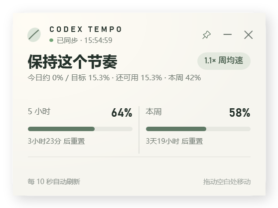

# Codex Tempo

一个轻量、安静的 Windows Codex 额度桌面小组件。

它每 10 秒读取一次本地额度快照，同时展示 5 小时与每周剩余额度，并根据本周进度告诉你今天用到多少比较合适。

## 下载

[下载最新版 Windows 安装包](https://github.com/zhangtingyu11/CodexTempo/releases/latest/download/CodexTempo-Setup-x64.exe)

双击安装即可，无需配置，也无需额外安装 .NET。程序未进行商业代码签名，Windows 首次运行时可能显示“未知发布者”。

## 功能

- 5 小时与每周额度实时显示
- 今日建议用量与使用节奏提醒
- 每 10 秒自动刷新
- 触碰屏幕边缘自动缩成紧凑模式
- 窗口置顶、托盘入口、桌面快捷方式与开机启动选项，不占用任务栏
- 关闭时可选择隐藏到托盘或彻底退出
- 只读取本地 Codex session，不联网、不上传数据

## 支持

如果 Codex Tempo 对你有帮助，可以请我喝杯咖啡 ☕

---

## English

Codex Tempo is a lightweight Windows desktop widget for keeping an eye on your Codex usage limits.

It refreshes every 10 seconds, shows the remaining 5-hour and weekly allowance, and suggests a comfortable daily pace so the weekly allowance lasts until reset.

### Download

[Download the latest Windows installer](https://github.com/zhangtingyu11/CodexTempo/releases/latest/download/CodexTempo-Setup-x64.exe)

Just run the installer—no configuration or separate .NET installation is required. The app is not commercially code-signed yet, so Windows may show an “Unknown publisher” warning on first launch.

### Features

- Live 5-hour and weekly allowance
- Suggested daily usage and pacing guidance
- Automatic refresh every 10 seconds
- Compact mode when touching a screen edge
- Always-on-top, system tray access, desktop shortcut, and optional startup without occupying the taskbar
- Choose between hiding to the tray and exiting when closing
- Local-only session reading with no network requests or data uploads

MIT License
